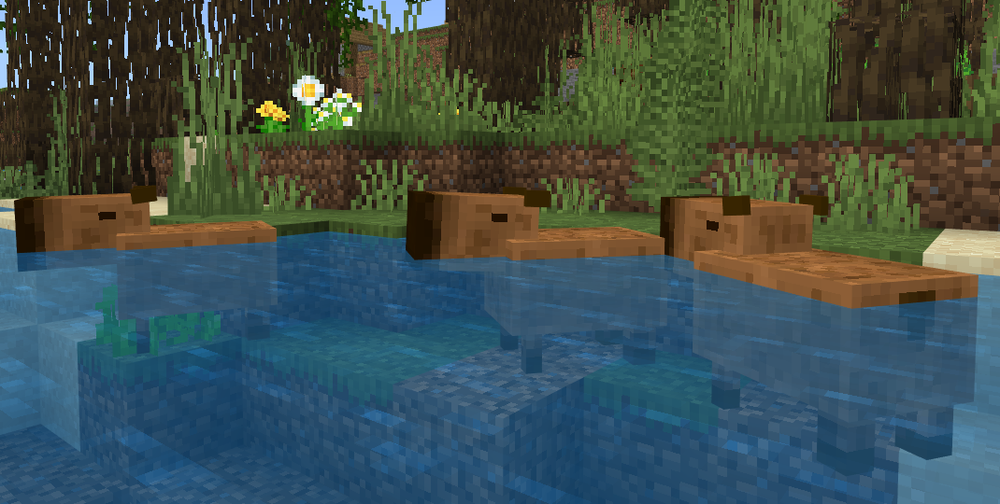

# Capibaras para Minecraft Bedrock
Agrega CAPIBARAS a tu mundo de MINECRAFT con este Addon para Minecraft Bedrock!

## ¿Qué son los capibaras?

El **capibara** es un roedor de gran tamaño que se encuentra en América del Sur. Es el roedor más grande del mundo y puede medir hasta 1,3 metros de longitud. Es un animal semiacuático y se encuentra principalmente en ríos y lagos. Es herbívoro y se alimenta de hierba y vegetación acuática. Es un animal social y a menudo se encuentra en grupos numerosos.

## ¿Qué agrega el addon a Minecraft Bedrock?

Este addon agrega la posibilidad de encontrar **capibaras** en diferentes biomas de **Minecraft Bedrock**, como **ríos**, **bosques**, **junglas**, **pantanos** y **manglares**. Estos animales aparecen en manadas de 2 a 7 y pueden ser adultos o bebés. Además, los capibaras pueden ser alimentados con tres tipos de vegetación acuática: Fondo marino (Seagrass), Algas (Kelp) y Nenúfares (Waterlily).

Estos mismos, pueden reproducirse, siendo alimentándolos con **Fondo marino** (Seagrass), **Algas** (Kelp) y **Nenúfares** (Waterlily). Al reproducirse, los **capibaras** también otorgan puntos de experiencia al jugador, entre 7 y 15 puntos.

## Comportamiento del mob dentro del juego

Este mob se encuentra de manera natural en los biomas de **ríos**, **bosques**, **junglas**, **pantanos** y **manglares**. Los **capibaras** se desplazan aleatoriamente entre tierra y agua, nadando en áreas poco profundas y emergiendo a la superficie. Si se encuentran cerca de una **gallina** o un **loro**, estos animales pueden subir a la cabeza del **capibara**, pero este no podrá bajarlos, por lo que es recomendable tener un área de agua con poca profundidad cerca si se tiene un **capibara** como mascota y un **loro** o **gallina** en su cabeza. También, al ser considerado un roedor, los **capibaras** pueden ser atacados por **ocelotes**.

## Loot

El loot de este mob es el mismo dejado por una **tortuga**.

| Mob      | Variante | Loot                                             |
| -------- | -------- | ------------------------------------------------ |
| Capibara | Adulto   | 0-2 **Fondo marino**; 0-1 **Cuenco**; 0-1 **XP** |
| Capibara | Bebé     | **Nada**                                         |

## Descarga del addon

Este addon se encuentra disponible para la versión de **Minecraft Bedrock** **_1.19_** en adelante. Si no sabes cómo instalar addons para **Minecraft Bedrock**, [aquí](https://seokku.tk/posts/instalar-addons-minecraft) te dejamos otro artículo para que veas cómo implementar un addon en tu mundo.

[Haz click aquí para descargar el addon para **Minecraft Bedrock 1.19 en adelante**](https://github.com/seokkuuu/minecraft-capybara-addon/releases/download/v1.0.0.1/capybaras-v1.0.0-by-seokku.mcaddon)

## IMPORTANTE LEER

Es importante tener en cuenta que este addon **está protegido por derechos de autor**. **No está permitida su redistribución sin autorización**. Descargarlo desde un sitio web no autorizado podría considerarse como **malware** y ser **peligroso**. El creador de este addon es [**@seokkuuu**](https://github.com/seokkuuu) y su código fuente está disponible en GitHub en [este enlace](https://github.com/seokkuuu/minecraft-capybara-addon).

Para colaborar con este proyecto a través de **GitHub**, usted deberá **Leer y Entender** la **Licencia de software** utilizada en este producto.

A futuro este addon se podrá ir actualizando, puedes volver a esta página estar atento a cuándo sale una nueva versión de este mismo addon, o revisar nuestro [Repositorio](https://github.com/seokkuuu/minecraft-capybara-addon) de **GitHub** para estar pendiente de los nuevos cambios.
